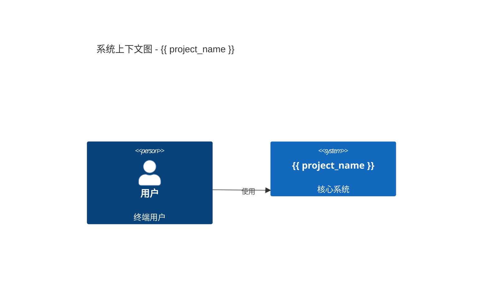

# {{ project_name }} - 系统架构设计

## 0. 文档控制 (Document Control)

| 属性 | 内容 |
|:---|:---|
| **文档编号** | ARCH-{{ year }}-{{ month }}-001 |
| **版本号** | v1.0.0 |
| **状态** | 草稿 (Draft) |
| **适用平台** | {{ platform }} |
| **负责人** | 系统架构师 |

---

## 1. 决策摘要 (Executive Summary)
### 1.1 技术愿景
> [在此插入技术愿景]

### 1.2 约束分析
- **平台**: {{ platform }}
- **规模目标**: [插入 MAU/QPS 目标]
- **合规性**: GDPR / 等保三级

## 2. 系统上下文 (C4 Level 1)

